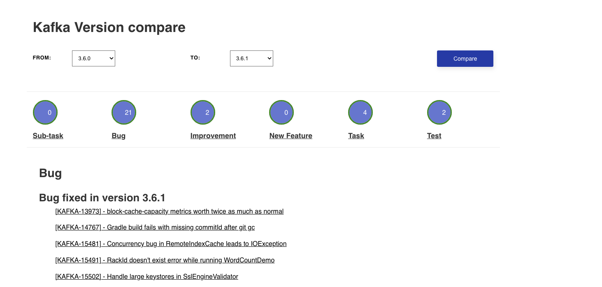

Apache Kafka Version Compare
=================
Taking inspiration from Umbraco compare [web site](https://our.umbraco.com/download/releases/compare).

This asp.net core application builds a version compare page for Apache Kafka. It uses the Apache Kafka [releases page](https://archive.apache.org/dist/kafka/) and for each version
retrieves the release page and parses it to build the versions.  The dropdowns allow you to pick 2 versions and a delta is created and displayed to show the differences.

### Run using Docker ###

```bash
cd KafkaVersionCompare
docker-compose up -d
```

open a browser on: http://localhost

<p float="left">
  
</p>


